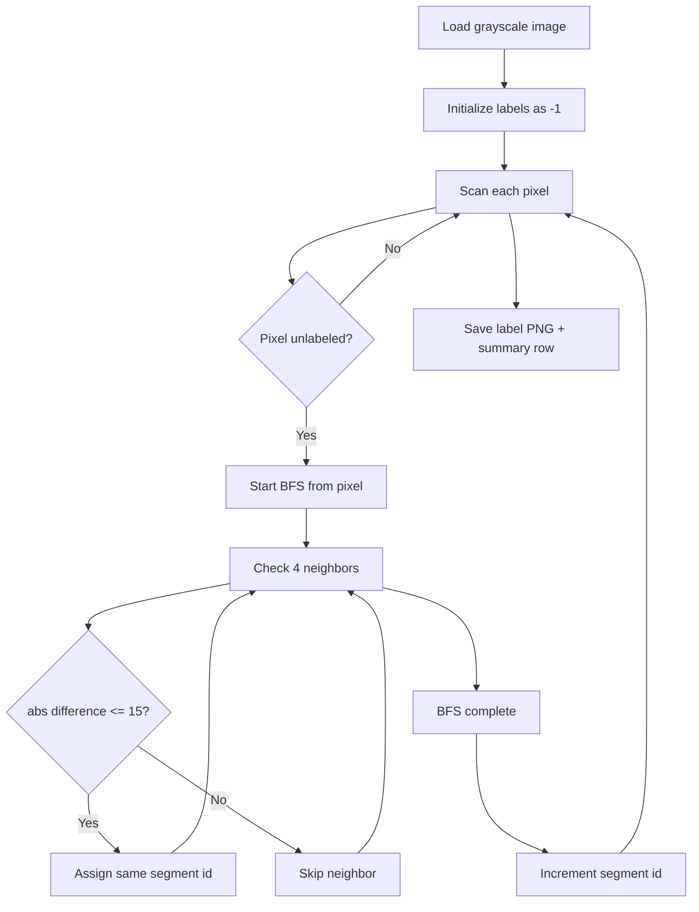
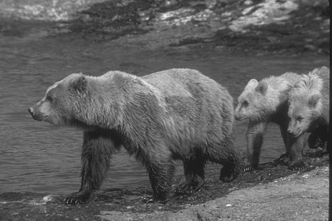
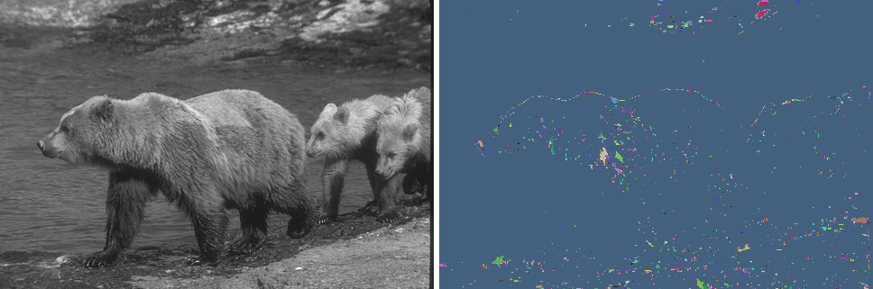

# Grayscale Image Segmentation (BFS)

This repository contains our solution for grayscale image segmentation using connected components with an intensity threshold. The goal is simple: assign every pixel to exactly one segment based on local similarity.

We deliberately kept the implementation lightweight and readable so the logic is easy to verify and reproduce.

## Project summary

- Core algorithm: Breadth-First Search (BFS) connected-component labeling
- Neighborhood: 4-directional only (up, down, left, right)
- Merge rule: $|I(p_1)-I(p_2)| \leq 15$
- Segment labels: zero-based IDs (0, 1, 2, ...)
- External segmentation APIs: not used

## Dataset and outputs

Input folders:

- [train/images](train/images)
- [test/images](test/images)

Generated output folders:

- [outputs/train](outputs/train): predicted masks for train set
- [outputs/test](outputs/test): predicted masks for test set
- [outputs/summary.csv](outputs/summary.csv): per-image summary (size + segment count)
- [visualizations/train](visualizations/train): side-by-side previews
- [visualizations/test](visualizations/test): side-by-side previews

Current run status:

- Train images processed: 100
- Test images processed: 50
- Total processed: 150
- Summary rows: 151 lines (header + 150 records)

## Approach

Implementation entry point: [segment.py](segment.py)

High-level flow:



Why BFS here?

- It naturally grows one connected region at a time.
- It is easy to enforce the exact neighbor rule and threshold rule.
- It gives predictable, consistent behavior across all images.

## Correctness notes

This implementation matches the task constraints directly:

1. 4-neighbor adjacency only.
2. Threshold check is performed when exploring each adjacent pixel.
3. Every pixel starts unlabeled, then gets assigned exactly once.
4. IDs are deterministic for a fixed traversal order.

## Performance

For an image with $H \times W$ pixels:

- Time complexity: $O(HW)$
- Space complexity: $O(HW)$ (labels + queue in worst case)

Measured runtime on this machine for full dataset (150 images):

- End-to-end segmentation run: 20.40 seconds

Command used:

```bash
/usr/bin/time -p .venv/bin/python segment.py
```

## Visualization pipeline

Raw label PNGs are correct but not very human-friendly to inspect, so we added [visualize.py](visualize.py).

What it does:

1. Loads original grayscale image.
2. Loads matching predicted mask from [outputs/train](outputs/train) or [outputs/test](outputs/test).
3. Maps each segment ID to a deterministic RGB color.
4. Writes a side-by-side comparison image.

Example:

<table>
  <tr>
    <td></td>
    <td></td>
  </tr>
</table>

## How to run

From repository root:

```bash
python segment.py
python visualize.py
```

If needed, use virtual environment python explicitly:

```bash
.venv/bin/python segment.py
.venv/bin/python visualize.py
```

## Repository structure

- [segment.py](segment.py): main segmentation script
- [visualize.py](visualize.py): visualization helper
- [outputs/summary.csv](outputs/summary.csv): per-image stats
- [outputs/test](outputs/test): final predicted masks for test set

## Submission checklist

Before submitting the form, verify:

1. Public GitHub repo is accessible.
2. [outputs/test](outputs/test) contains exactly 50 PNG masks with original filenames.
3. Final commit link points to the last submission commit.
4. Demo video link (3-5 min) clearly shows what the project does and how it works.